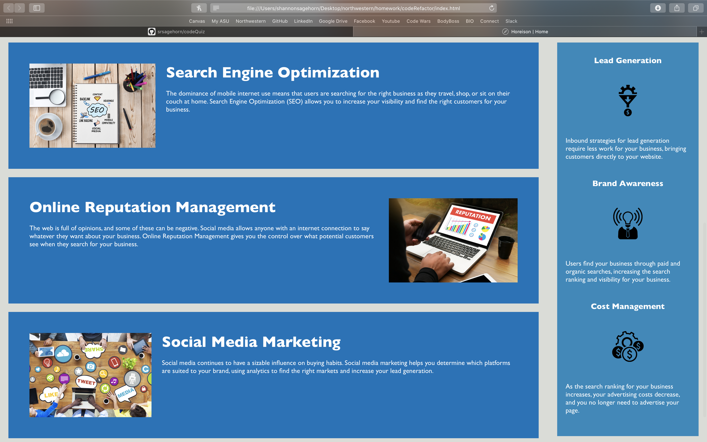

# Code Refactor

https://srsagehorn.github.io/sagehornHW1/

## Description

HTML and CSS refactor for a fictional landing page of a company called Horiseon. Refactored with reformatted HTML and semantic tags. Reorganized CSS with tags in order and reduced rewritten style applications to the same objects

